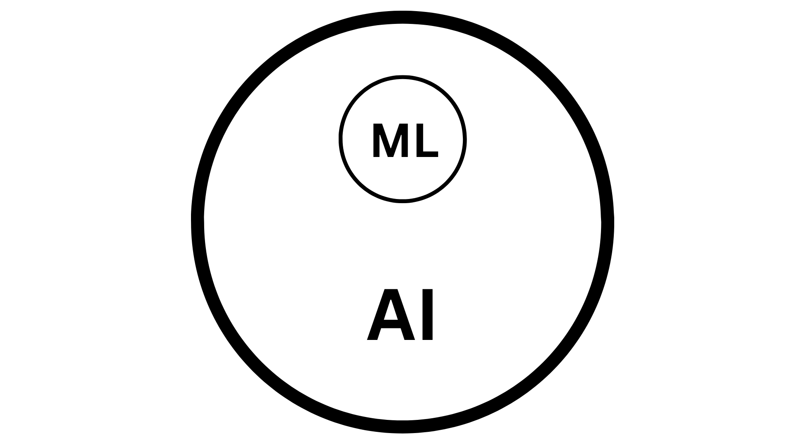
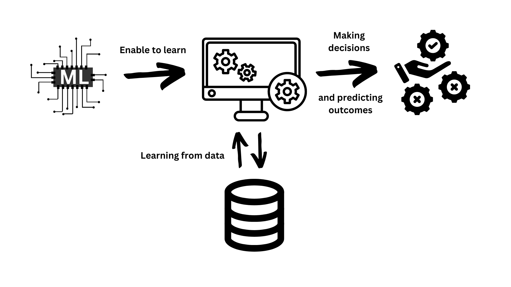

# A Gentle Introduction to Machine Learning

## Section 1.1: Defining Machine Learning
Machine learning is a subfield of artificial intelligence that focuses on the development of 
computer algorithms that improve automatically through experience and by using data. 
In other words, machine learning is all about enabling computers to learn from data, 
make decisions, and predict outcomes without being explicitly programmed to do so.

For example, a machine learning model could learn from historical weather data to 
predict tomorrow's weather, or it could learn from thousands of dog and cat images 
to tell the difference between a dog and a cat.

## Section 1.2: Understanding Artificial General Intelligence (AGI)
Artificial General Intelligence (AGI), also referred to as strong AI, 
is a form of artificial intelligence that has the ability to understand, 
learn, and apply knowledge across a wide range of tasks at a level equal 
to or beyond a human being. Unlike Narrow Artificial Intelligence, which 
is designed to perform a specific task, such as recommending a product 
or recognizing a face, AGI can transfer learning from one domain to another, 
adapt to new situations, and solve problems it has never encountered before.
As of the time of writing, AGI remains largely a theoretical concept. 
While we've made great strides in developing narrow AI applications, creating
 a system with human-like cognitive abilities is a considerable challenge that 
 researchers are still working on.

## Section 1.3: Why We Need Machine Learning
In the modern world, we are generating data at an unprecedented rate. 
From social media posts and online shopping habits to healthcare records 
and weather observations, we are surrounded by a wealth of information. 
The challenge is: how do we make sense of this enormous amount of data? 
The traditional methods of data analysis simply cannot keep up with the volume, 
variety, and velocity of the data we produce.
This is where machine learning comes in. Machine learning, a subfield of 
artificial intelligence, offers tools and techniques to analyze and interpret 
complex data. It can identify patterns, learn from experience, and make predictions 
or decisions without being explicitly programmed to perform the task. 
Machine learning allows us to turn raw data into actionable insights, 
helping businesses optimize their operations, doctors diagnose diseases more accurately,
 and individuals get personalized recommendations, among many other applications.

## Section 1.4: Types of Machine Learning Algorithms
Machine learning algorithms can be broadly classified into three types:
1.	**Supervised Learning:** In supervised learning, the algorithm learns from labeled data. 
We provide the model with input-output pairs, and the model learns to map the input to 
the correct output. An example of this would be a spam email filter, where the model is 
trained on emails labeled as "spam" or "not spam".
2.	**Unsupervised Learning:** In unsupervised learning, the algorithm learns from unlabeled data.
 The model tries to find patterns and structures in the data without any guidance.
  An example of this would be a customer segmentation model that groups customers
   based on their purchasing behavior.
3.	**Reinforcement Learning:** In reinforcement learning, the algorithm learns by 
interacting with its environment and receiving feedback in the form of rewards or punishments.
 The model learns to make decisions that maximize the reward over time. 
 An example of this would be a self-driving car learning to navigate roads.
 
As we delve deeper into each of these types in the following chapters, you'll get a clearer understanding of how they work and where they can be applied. Machine learning is a fascinating field, full of potential and possibilities. As you continue to explore, remember that the goal is not just to understand the theory, but also to see how this technology can be used to solve real-world problems.
