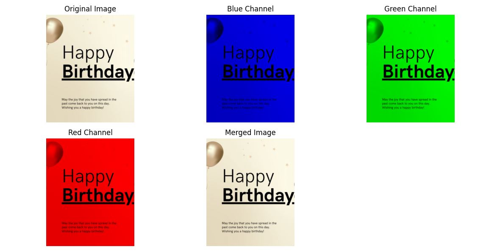

# Image Channels

## Introduction:

The provided code snippet is a Python script for computer vision tasks using the OpenCV library. The purpose of this code is to demonstrate how to split an image into its individual color channels (Blue, Green, and Red) and then merge them back to reconstruct the original image. This process is a fundamental operation in computer vision and image processing. This process is a fundamental concept in computer vision and image processing, as it allows us to manipulate and analyze images based on their color channels. The code uses the OpenCV library for image processing, NumPy for array manipulations, and Matplotlib for visualization.

## Code Overview:

The main goal of the code is to demonstrate how to split an image into its color channels, create separate images for each channel, and then merge them back to reconstruct the original image. The code takes an input image 'HBD.jpg', loads it using OpenCV, performs channel splitting, individual channel image creation, and then displays the original and channel-separated images using Matplotlib.

Code Breakdown:
Let's go through each part of the code step-by-step:

```python

import cv2
import numpy as np
import matplotlib.pyplot as plt

```
These lines import the necessary libraries. `cv2` is the OpenCV library used for computer vision tasks, `numpy` is imported as `np` to work with numerical arrays in Python, and `matplotlib.pyplot` for visualization.

```python

image = cv2.imread('HBD.jpg')


```

This line loads the image 'HBD.jpg' from the current directory using OpenCV's `imread` function. The loaded image is stored in the variable `image`.

```python

b, g, r = cv2.split(image)


```

This line splits the loaded image into its individual color channels, namely Blue, Green, and Red. The `cv2.split` function returns three separate channels, each represented as a 2D numpy array.

```python

blue_channel = np.zeros_like(image)


```

This line creates an empty image with the same dimensions as the original image. It uses `np.zeros_like` to create a black (all-zero) image with the same shape as the input image. This image will be used to store only the blue channel.

```python

blue_channel[:, :, 0] = b

```

This line assigns the values of the Blue channel `b` to the Blue channel of the `blue_channel` image. Since we want to keep only the Blue channel, we assign `b` to the first channel (index 0) of the `blue_channel` image.

Similarly, two more empty images are created and assigned the respective Green and Red channels.

```python

merged_image = cv2.merge([b, g, r])

```

This line merges the three separated color channels (`b`, `g`, and `r`) back into a single image. The `cv2.merge` function takes a list of channels as input and returns the merged image.

```python

plt.figure(figsize=(12, 6))

plt.subplot(2, 3, 1)
plt.imshow(cv2.cvtColor(image, cv2.COLOR_BGR2RGB))
plt.title('Original Image')
plt.axis('off')

# ... Similar code for displaying the individual channel images ...

plt.tight_layout()
plt.show()

```

This part sets up a Matplotlib figure with multiple subplots to display the original image and the individual channel images.
- `plt.figure(figsize=(12, 6))`:
This line creates a new Matplotlib figure to hold the subplots. The figsize parameter specifies the size of the figure, where the first value represents the width in inches, and the second value represents the height in inches. In this case, we set the figure size to 12 inches wide and 6 inches tall.

- `plt.subplot(2, 3, 1)`:
This code defines the first subplot in a 2x3 grid of subplots. The parameters for plt.subplot(rows, columns, index) determine the grid layout and the position of the subplot within the grid. Here, we set it to the first position (index 1) in a 2x3 grid.

- `plt.imshow(cv2.cvtColor(image, cv2.COLOR_BGR2RGB))`: This line displays the original image. However, before displaying it, we use cv2.cvtColor to convert the BGR image format (used by OpenCV) to the RGB format (used by Matplotlib). The conversion is necessary because OpenCV reads images in the BGR format, while Matplotlib expects images in the RGB format.

- `plt.title('Original Image')`: This line sets the title of the subplot to 'Original Image'.

- `plt.axis('off')`: This line removes the axis ticks and labels from the subplot, resulting in a cleaner image display without the axis markings.

## Detailed Explanation:

Now, let's dive deeper into the concepts and techniques used in the code:

### Image Representation:
In this code, images are represented as three-dimensional numpy arrays with the shape (height, width, channels). The channels correspond to the color components: Blue, Green, and Red (BGR) in the case of OpenCV.

### Splitting and Merging Channels:
Images can be split into individual color channels using the `cv2.split` function, which returns separate 2D numpy arrays for each channel. After processing these channels individually, they can be merged back into a single image using the `cv2.merge` function.

### numpy.zeros_like:
The `np.zeros_like` function creates an array of zeros with the same shape as the input array (in this case, the original image). It is a convenient way to create an empty image with the same size as the original image.

## Output

Upon successful execution, you should see a Matplotlib window with five subplots:



The first subplot shows the original image.
The second subplot displays only the blue channel.
The third subplot displays only the green channel.
The fourth subplot displays only the red channel.
The fifth subplot shows the merged image, reconstructing the original image.

## Conclusion:

This tutorial explained the code snippet for splitting an image into its color channels and merging them back together using OpenCV and numpy in Python. Understanding these fundamental operations is crucial for various computer vision tasks, such as image processing, object detection, and image enhancement. By exploring and experimenting with these concepts, you can gain a deeper understanding of image manipulation techniques and apply them to real-world applications.