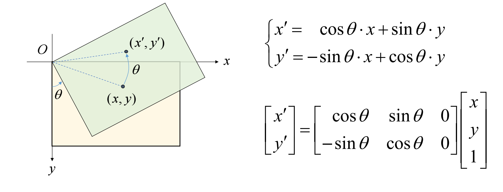
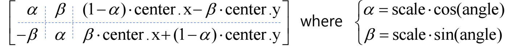
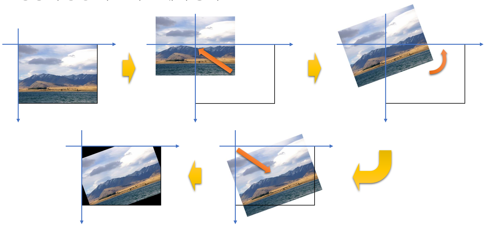
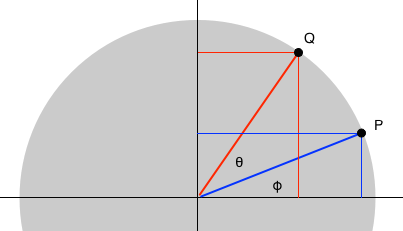
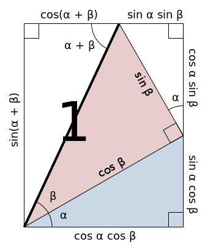

# Rotation of an image
- rotation transformation
  - Rotate the image by a specific angle (counterclockwise)



``` 
src = cv2.imread('tekapo.bmp')

rad = 20 * math.pi / 180

aff = np.array([[math.cos(rad), math.sin(rad), 0],
				[-math.sin(rad), math.cos(rad), 0]], dtype=np.float32)

dst = cv2.warpAffine(src, aff, (0, 0))
```


Obtaining the Rotation Transformation Matrix of an Image

`cv2.getRotationMatrix2D(center, angle, scale) -> retval`

center: rotation center coordinates (x,y) tuple

angle: (counterclockwise) angle of rotation, negative numbers are clockwise

scale: additional scaling factor

retval: 2 * 3 affine transformation matrix, real number type.




Example of rotation about center

```
src = cv2.imread('tekapo.bmp')

cp = (src.shape[1] / 2, src.shape[0] / 2)
rot = cv2.getRotationMatrix2D(cp, 20, 1)

dst = cv2.warpAffine(src, rot, (0, 0))
```



The formula `-sin_theta * center_x + (1 - cos_theta) * center_y` is part of the calculation for the translation component of the 2D rotation matrix. This formula is used to rotate an image around a specific point (the center of the image). The formula takes into account the center of the image and the angle of rotation to calculate the new position of the image after rotation.

To understand how this formula is derived, let's consider a point `(x, y)` that we want to rotate around the origin `(0, 0)` by an angle `theta`. The new coordinates `(x', y')` after rotation can be calculated using the following equations:

```
x’ = x * cos(theta) - y * sin(theta) 

y’ = x * sin(theta) + y * cos(theta)
```


Now, let's say we want to rotate the point `(x, y)` around a different point `(center_x, center_y)` instead of the origin. We can do this by first translating the point `(x, y)` so that `(center_x, center_y)` becomes the new origin, then rotating around this new origin using the above equations, and finally translating back to the original position.

The translation can be done by subtracting `center_x` from `x` and `center_y` from `y`. After rotation around the new origin, we add `center_x` and `center_y` back to get the final coordinates. The complete calculation for the new coordinates `(x', y')` after rotation around `(center_x, center_y)` is as follows:

```
x’ = (x - center_x) * cos(theta) - (y - center_y) * sin(theta) + center_x
 
y’ = (x - center_x) * sin(theta) + (y - center_y) * cos(theta) + center_y
```


Expanding these equations and rearranging terms, we get:

```
x’ = x * cos(theta) - y * sin(theta) + (-sin(theta) * center_x + (1 - cos(theta)) * center_y) 

y’ = x * sin(theta) + y * cos(theta) + (cos(theta) * center_x + sin(theta) * center_y - center_x)
```


As you can see, `-sin_theta * center_x + (1 - cos_theta) * center_y` is part of the calculation for the new x-coordinate `x'` after rotation around `(center_x, center_y)`.


###### Consider what happens when we take a point (x,y) and rotate it by an angle of θ:



Using polar coordinates, we can write **`( x, y ) = ( r cos ϕ, r sin ϕ )`** where r is the distance from (x,y) to the origin and ϕ is the angle made by the line from the origin to (x,y) and the positive x-axis.

After rotating (x,y) by an angle of θ, the new point is still r units away from the origin, but now, the angle made by the line from the origin to (x′,y′) and the positive x-axis increases by θ. Hence, **`(x′,y′)=(r cos ( ϕ + θ ), r sin( ϕ + θ ))`**.

Now, let's use **[the cosine and sine sum of angle formulas](#linktoheadline)** to write x′ and y′ in terms of x and y:

**`
x′ = r cos( ϕ + θ ) = r cos ϕ cos θ − r sin ϕ sin θ = x cos θ − y sin θ
`**

**`
y′ = r sin( ϕ + θ ) = r sin ϕ cos θ + r cos ϕ sin θ = y cos θ + x sin θ 
`**

Putting this into matrix form gives us:

 **` ( x′ y′ ) = ( cos θ sin θ −sin θ cos θ )( x y ) `**

Hence, the matrix which rotates a point by an angle of θ counterclockwise is **`( cos θ sin θ − sin θ cos θ )`**.


<h6 id="linktoheadline">The cosine and sine sum of angle formulas</h6>

**`cos(θ) = adjacent/hypotenuse`**

**`sin(θ) = opposite/hypotenuse`**



**`cos(α + β) = cos(α) * cos(β) - sin(α) * sin(β)`**

**`sin(α + β) = sin(α) * cos(β) + cos(α) * sin(β)`**